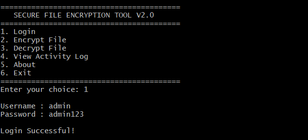
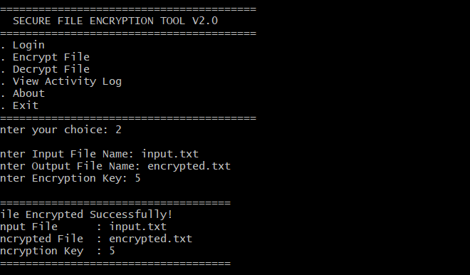
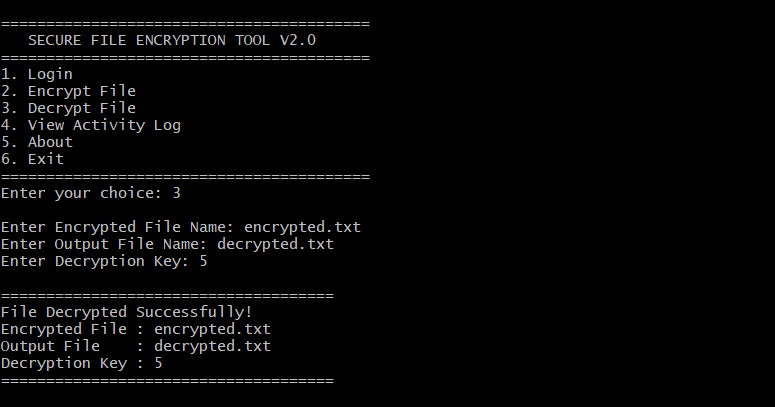
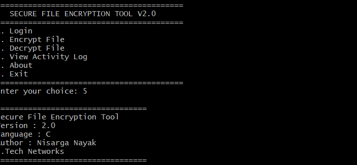

# 🔐 File Encryption & Decryption Tool (C)

A menu-driven **File Encryption & Decryption Tool** developed using the **C programming language**. This project allows users to encrypt and decrypt text files using the Caesar Cipher technique while demonstrating file handling and basic cybersecurity concepts.

---

## 📌 Features

* 🔒 Encrypt Text Files
* 🔓 Decrypt Encrypted Files
* 📂 Read and Write Files
* 🔑 Caesar Cipher Encryption
* 🖥️ Menu-Driven Console Application
* ⚠️ Error Handling for Missing Files

---

## 🛠️ Technologies Used

* C Programming
* GCC Compiler (MSYS2 UCRT64)
* Visual Studio Code
* File Handling

---

## 📁 Project Structure

```text
File-Encryption-Decryption-Tool/
│── main.c
│── input.txt
│── encrypted.txt
│── decrypted.txt
│── README.md
```

---

## 🚀 How to Run

### 1. Clone the repository

```bash
git clone https://github.com/YOUR_GITHUB_USERNAME/File-Encryption-Decryption-Tool.git
```

### 2. Open the project folder

```bash
cd File-Encryption-Decryption-Tool
```

### 3. Compile the program

```bash
gcc main.c -o main
```

### 4. Run the program

```bash
./main.exe
```

---

## 📸 Screenshot

### 🏠 Main Menu


### 🔒 File Encryption


### 🔓 File Decryption


---

## 📚 Concepts Used

* File Handling
* Functions
* Loops
* Conditional Statements
* Character Manipulation
* Caesar Cipher Encryption

---

## 🎯 Future Enhancements

* User-Defined Encryption Key
* XOR Encryption
* Password Protection
* Encrypt Any File by Filename
* Activity Log
* Input Validation
* Enhanced Security Techniques

---
# 🔐 Secure File Encryption & Decryption Tool (Version 2)

A secure file encryption and decryption application developed in **C Programming**. This Version 2 release introduces **user authentication, activity logging, an about section, and user-defined encryption keys**, making the application more secure and user-friendly.

---

## 🚀 Version 2 Features

- 🔐 User Login Authentication
- 🔒 Encrypt Text Files
- 🔓 Decrypt Encrypted Files
- 🔑 User-defined Encryption & Decryption Key
- 📂 Custom Input & Output File Names
- 📜 Activity Log (`log.txt`)
- ℹ️ About Section
- ⚠️ Error Handling
- 💻 Console-Based Interface

---

## 🛠 Technologies Used

- C Programming
- GCC Compiler
- File Handling
- String Handling (`string.h`)
- Time Library (`time.h`)
- Standard C Library

---

## 📂 Project Structure

```
Secure-File-Encryption-Tool/
│── main.c
│── input.txt
│── encrypted.txt
│── decrypted.txt
│── log.txt
│── README.md
└── screenshots/
    ├── login.png
    ├── menu-v2.png
    ├── encrypt-v2.png
    ├── decrypt-v2.png
    ├── log.png
    └── about.png
```

---

## ⚙️ How to Compile

```bash
gcc main.c -o main
```

---

## ▶️ How to Run

```bash
./main
```

---

## 🔑 Default Login Credentials

**Username:** `admin`

**Password:** `admin123`

---

## 📸 Screenshot

## 📸 Screenshots

### Login



### Main Menu


### Encrypt



### Decrypt



### About



## 📚 Concepts Used

- Functions
- File Handling
- User Authentication
- Caesar Cipher Encryption
- Activity Logging
- String Handling
- Conditional Statements
- Loops

---

## 🔮 Future Improvements

- XOR Encryption
- AES Encryption
- Password Masking
- Multiple User Accounts
- Binary File Encryption
- GUI Version
- Stronger Encryption Algorithms

---

## 👨‍💻 Author

**Nisarga Nayak**

**B.Tech Networks**


