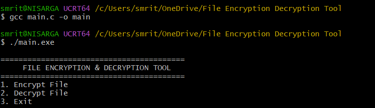
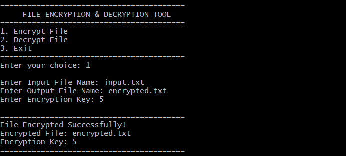
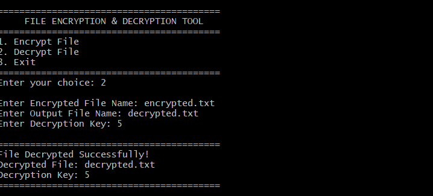

# 🔐 File Encryption & Decryption Tool (C)

A menu-driven **File Encryption & Decryption Tool** developed using the **C programming language**. This project allows users to encrypt and decrypt text files using the Caesar Cipher technique while demonstrating file handling and basic cybersecurity concepts.

---

## 📌 Features

* 🔒 Encrypt Text Files
* 🔓 Decrypt Encrypted Files
* 📂 Read and Write Files
* 🔑 Caesar Cipher Encryption
* 🖥️ Menu-Driven Console Application
* ⚠️ Error Handling for Missing Files

---

## 🛠️ Technologies Used

* C Programming
* GCC Compiler (MSYS2 UCRT64)
* Visual Studio Code
* File Handling

---

## 📁 Project Structure

```text
File-Encryption-Decryption-Tool/
│── main.c
│── input.txt
│── encrypted.txt
│── decrypted.txt
│── README.md
```

---

## 🚀 How to Run

### 1. Clone the repository

```bash
git clone https://github.com/YOUR_GITHUB_USERNAME/File-Encryption-Decryption-Tool.git
```

### 2. Open the project folder

```bash
cd File-Encryption-Decryption-Tool
```

### 3. Compile the program

```bash
gcc main.c -o main
```

### 4. Run the program

```bash
./main.exe
```

---

## 📸 Screenshot

### 🏠 Main Menu



### 🔒 File Encryption



### 🔓 File Decryption



### 📄 Input File


### 🔐 Encrypted File


### 📄 Decrypted File


---

## 📚 Concepts Used

* File Handling
* Functions
* Loops
* Conditional Statements
* Character Manipulation
* Caesar Cipher Encryption

---

## 🎯 Future Enhancements

* User-Defined Encryption Key
* XOR Encryption
* Password Protection
* Encrypt Any File by Filename
* Activity Log
* Input Validation
* Enhanced Security Techniques

---

## 👨‍💻 Author

**Nisarga Nayak**

**B.Tech (Networks)**


